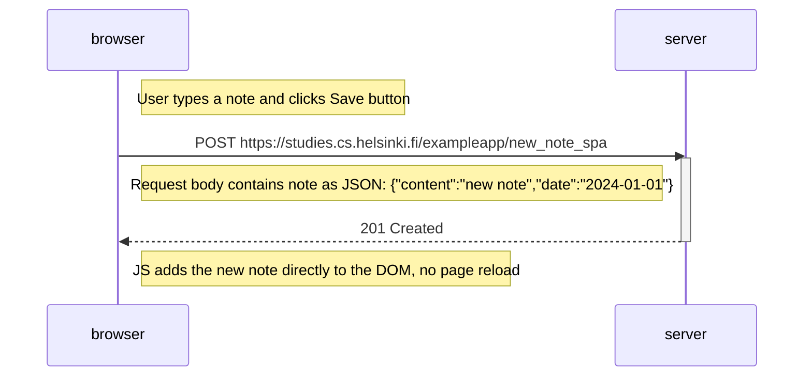

# Exercise 0.6 - New Note in Single Page App Sequence Diagram

```mermaid
sequenceDiagram
    participant browser
    participant server

    Note right of browser: User types a note and clicks Save button

    browser->>server: POST https://studies.cs.helsinki.fi/exampleapp/new_note_spa
    activate server
    Note left of server: Request body contains note as JSON: {"content":"new note","date":"2024-01-01"}
    server-->>browser: 201 Created
    deactivate server

    Note right of browser: JS adds the new note directly to the DOM, no page reload
```